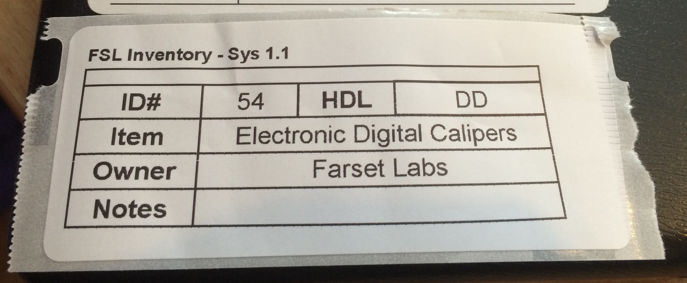

# Farset Label Generator 



Included in this repository is a simple tool to create labels in SVG format for the Farset Labs Dyno label printer.   
It is written in Python and supports both Python 2 and Python 3.   

# How to use
1. Simply run the program in interactive mode, it will ask for each required value for the badge, then spit out a filled in SVG file.
2. Run the program but include a number of parameters   
```python3 Label-builder.py id hdl itemName owner notes```   
There are also 2 optional parameters that can be used   
```python3 Label-builder.py id hdl itemName owner notes templateFile newLabelFile```
